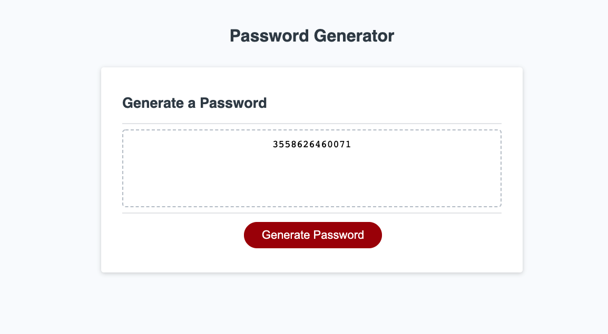

# Password Generator

## Given the starter code I had to:
Create the javascript to generate a password. Upon clicking the generate password button this will happen in this order.
1. Prompt the user to give password length from 8-128 characters.
2. Ask the user if they want to use lowercase letters.
3. Ask the user if they want to use UPPERCASE letters.
4. Ask the user if they want to use numerical characters.
5. Ask the user if they want to use special characters.
6. Generate a random password to be printed using the users inputs as criteria.

## Purpose
A website built to generate random passwords following user criteria.

## Built with
* HTML
* CSS
* JS

## Website
https://thomasemanuel.github.io/te-challenge3-passwordGenerator/

## Contribution
Made with ❤️ by Thomas Emanuel